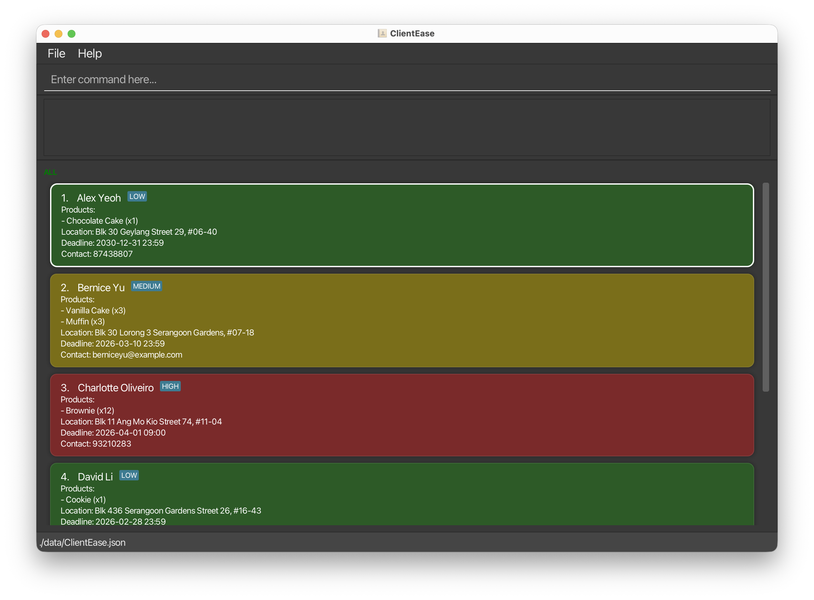

# ClientEase User Guide

**ClientEase is designed for tech-savvy home-based online business owners** who manage a small to medium customer base,
perform frequent daily updates to customer contact information, and prefer fast, command-line-style text input over
GUI-driven interactions.

Instead of clicking through multiple menus, ClientEase lets you type short commands to add customers, search by fields,
track products and deadlines, and retrieve information instantly, keeping your records organised without the overhead
of full-scale business management systems.

- If you are new to ClientEase, start with the [Quick Start](#quick-start) section.
- If you are looking for a specific command, jump to the [Command Summary](#command-summary).
- If you are a developer, refer to the [Developer Guide](https://ay2526s2-cs2103t-t12-2.github.io/tp/DeveloperGuide.html).

---

## Table of Contents

- [Who Is This Guide For?](#who-is-this-guide-for)
- [Quick Start](#quick-start)
  - [Installation](#installation)
  - [Overview of the Interface](#overview-of-the-interface)
  - [Your First Commands](#your-first-commands)
- [Features](#features)
  - [Notes on Command Format](#notes-on-command-format)
  - [Viewing Help : `help`](#viewing-help--help)
  - [Adding a Customer : `add`](#adding-a-customer--add)
  - [Listing All Customers : `list`](#listing-all-customers--list)
  - [Editing a Customer : `edit`](#editing-a-customer--edit)
  - [Locating Customers : `find`](#locating-customers--find)
  - [Deleting a Customer : `delete`](#deleting-a-customer--delete)
  - [Clearing All Customers : `clear`](#clearing-all-customers--clear)
  - [Exiting the App : `exit`](#exiting-the-app--exit)
- [Saving the Data](#saving-the-data)
- [Editing the Data File](#editing-the-data-file)
- [FAQ](#faq)
- [Known Issues](#known-issues)
- [Command Summary](#command-summary)
- [Glossary](#glossary)

---

## Who Is This Guide For?

ClientEase is built for **home-based online business owners** who:

- Manage a **small to medium customer base** (typically under a few hundred contacts)
- Perform **frequent daily updates** to customer information, such as new orders, contact changes, or delivery deadlines
- Prefer **keyboard-driven workflows** over clicking through menus

This guide assumes you are comfortable with:

| Assumed Skill | What It Means in Practice |
|---|---|
| Basic terminal use | Opening a terminal, using `cd` to navigate folders, running `java -jar` commands |
| Simple command syntax | Typing structured commands like `add name/John Doe contact/98765432` |
| Reading on-screen feedback | Interpreting short success or error messages shown in the app |
| Basic data awareness | Understanding that your data is stored in a local file, and knowing to back it up |

> **Not sure if ClientEase is right for you?** If you manage more than a few hundred customers with complex team
> workflows, you may want a full-scale CRM instead.

---

## Quick Start

### Installation

1. Ensure you have **Java 17 or above** installed. Verify by running:
   ```
   java -version
   ```
   > **Mac users:** Ensure you have the precise JDK version prescribed
   > [here](https://se-education.org/guides/tutorials/javaInstallationMac.html).

2. Download the latest **`clientease.jar`** file from the
   [releases page here](https://github.com/AY2526S2-CS2103T-T12-2/tp/releases).

3. Move the file to a folder you want to use as your **home folder** (e.g., `~/ClientEase/`).

4. Open a terminal and navigate to that folder:
   ```
   cd ~/ClientEase
   ```

5. Run the application:
   ```
   java -jar clientease.jar
   ```

   ClientEase will launch with a set of sample customer data so you can explore right away.

---

### Overview of the Interface



| Area | Purpose |
|---|---|
| **Customer List Panel** | Displays all customers currently shown, with their name, products, location, deadline, and contact |
| **Command Box** (top) | Where you type your commands |
| **Result Display** (below command box) | Shows success messages or error feedback after each command |
| **Status Bar** (bottom) | Shows the data file save location |

---

### Your First Commands

Here is a short walkthrough to get familiar with ClientEase. Try each command by typing it into the command box and
pressing **Enter**.

**Step 1 - See what's already in the app:**
```
list
```
Expected output: All sample customers are shown in the Customer List Panel.

**Step 2 - Add your first real customer:**
```
add name/Jane Tan contact/91234567;jane@mybusiness.com products/Chocolate Cake, Muffin location/Tampines deadline/2025-12-31
```
Expected output: `Added Customer: Jane Tan`

**Step 3 - Find a customer by name or contact:**
```
find Jane
```
Expected output: Only customers whose name or contact matches "Jane" are shown.

**Step 4 - Update a customer's contact details:**
```
edit 1 contact/99887766;newemail@example.com
```
Expected output: The first customer's contact details are updated.

**Step 5 - Delete a customer:**
```
delete 1
```
Expected output: `SUCCESS: Deleted Person: [customer details]`

**Step 6 - Exit the app:**
```
exit
```
Expected output: `Goodbye! Exiting ClientEase. You have X customer(s) saved.`

> **Tip:** All your data is saved automatically after every command. You never need to press a "Save" button.

---

## Features

### Notes on Command Format

> **Read this before using any command.**

- Words in `UPPER_CASE` are **parameters you supply**. For example, in `add name/NAME`, replace `NAME` with the actual
  name, e.g. `add name/John Doe`.
- Items in `[square brackets]` are **optional**. For example, `name/NAME [contact/CONTACT]` can be used with or without
  a contact.
- Parameters can be entered **in any order**. For example, `add name/John Doe contact/98765432` is the same as
  `add contact/98765432 name/John Doe`.
- Commands that take no parameters (e.g. `help`, `list`, `exit`) will **ignore any extra text** you type after them.
- If you are using a **PDF version** of this guide, be careful when copying multi-line commands - line breaks may cause
  spaces to be omitted.

---

### Viewing Help : `help`

Opens a help window with the User Guide URL.

**Format:** `help`

**Expected output:** A help window appears showing a User Guide URL and a **Copy URL** button.

> **Tip:** You can also press **F1** to open the help window at any time.

---

### Adding a Customer : `add`

Adds a new customer record to ClientEase.

**Format:**
```
add name/NAME [products/PRODUCTS] [location/LOCATION] [deadline/DEADLINE] [contact/CONTACT]
```

**Parameter details:**

| Parameter | Required? | Notes |
|---|---|---|
| `name/NAME` | Yes | 1-100 characters after trimming and space normalisation. Only ASCII letters (A-Z), spaces, `.`, `'`, and `-`. Must contain at least one letter. Names are unique case-insensitively and with repeated spaces collapsed. |
| `products/PRODUCTS` | No | Comma-separated list of 1-5 items chosen from: Muffin, Chocolate Cake, Vanilla Cake, Brownie, Cookie. Matching is case-insensitive. Empty items are invalid. |
| `location/LOCATION` | No | Non-blank after trimming. Maximum length 200 characters. |
| `deadline/DEADLINE` | No | Accepted formats: `yyyy-MM-dd HH:mm`, `yyyy-MM-dd`, `dd/MM/yyyy`. Entries without a time default to **23:59**. |
| `contact/CONTACT` | No | Semicolon-separated entries. Each entry must be either an 8-digit local phone number or an international phone in `+<2-3 digit country code><1-12 digit number>` format; spaces in phone numbers are ignored. Emails are up to 100 characters, must start with an alphanumeric character, contain only letters, digits, dots, and hyphens, and contain exactly one `@` with an alphanumeric at the start of the domain. Empty entries (e.g. trailing or double `;`) are invalid. |

**Other constraints:**

- Shorthands `n/`, `p/`, `l/`, `d/`, and `c/` are accepted.
- Each prefix can appear at most once. 
- Unrecognised `<word>/` prefixes are rejected.
- Optional fields can be omitted. 
- If a prefix is provided with no value (e.g. `products/`), the field is treated as empty.
- Non-ASCII characters (e.g. Chinese) are rejected in `name/`, `products/`, and `contact/`. `location/` currently accepts
  any characters as long as it is non-blank and within the length limit.

> **Warning:** If you try to add a customer with a name that already exists (case-insensitive, spaces normalised),
> ClientEase will reject the entry and display an error. Check the existing list with `list` before adding.

**Products are listed as a numbered list under each customer card.**

**Examples:**

```
add name/John Doe contact/98765432;johnd@example.com products/Chocolate Cake, Muffin location/Clementi Ave 2 deadline/2025-12-31
```
Adds a customer named John Doe, with two products, a location, a deadline of 31 Dec 2025 at 23:59, and two contact
details.

```
add name/Sarah Lim
```
Adds a customer named Sarah Lim with no other details. You can `edit` to fill in the rest later.

---

### Listing All Customers : `list`

Shows all customers currently saved in ClientEase, resetting any active search filter.

**Format:** `list` or `ls`

**Expected output:** All customers are shown in the Customer List Panel, and the result display shows `Listed all
customers`.

> **Tip:** Use `list` after a `find` command to return to the full customer list.

---

### Editing a Customer : `edit`

Updates the details of an existing customer.

**Format:**
```
edit INDEX [name/NAME] [products/PRODUCTS] [location/LOCATION] [deadline/DEADLINE] [contact/CONTACT]
```

- `INDEX` refers to the number shown beside the customer in the current list. It must be a **positive integer**
  (1, 2, 3, ...).
- At least **one field** must be provided.
- Any field you specify will **replace** the existing value entirely.

> **Warning:** Editing `contact/` or `products/` replaces all existing values. To clear a field entirely, provide the
> prefix with no value, e.g. `products/`.

**Examples:**

```
edit 1 contact/91234567;newemail@example.com
```
Replaces the contact details of the 1st customer.

```
edit 2 name/Betsy Crower products/
```
Renames the 2nd customer and clears all their products.

```
edit 3 deadline/2026-03-15 location/Bedok North Ave 1
```
Updates the deadline and location of the 3rd customer.

**Expected output:** `Edited Customer: [updated customer details]`

---

### Locating Customers : `find`

Searches for customers whose name or contact entries match any of the given keywords.

**Format:**
```
find KEYWORD [MORE_KEYWORDS]
```

- The search is **case-insensitive**.
- Name matching is by full words (e.g. `Jan` will not match `Jane`).
- Contact matching requires the full contact entry to match (e.g. `9123` will not match `91234567`).
- Keywords are combined with **OR logic**: a customer appears if at least one keyword matches.
- Each keyword must be 100 characters or fewer.

**Examples:**

```
find John
```
Returns customers whose name contains the full word "John".

```
find 98765432
```
Returns customers whose contact list contains the exact entry `98765432`.

```
find jane@example.com
```
Returns customers whose contact list contains that exact email.

**Expected output:** The Customer List Panel updates to show only matching customers. The result display shows
`X persons listed!`

> **Tip:** After a `find`, use `list` to restore the full customer list.

---

### Deleting a Customer : `delete`

Removes a customer from ClientEase permanently.

**Format:**
```
delete INDEX
```
```
del INDEX
```

- `INDEX` must be a **positive integer** matching the number shown in the current list.
- If the **customer list is empty**, an error is shown: `Error: Customer list is empty.`
- If the index is out of range, an error is shown: `The person index provided is invalid`.

> **Warning:** Deletion is permanent. There is no undo command. Double-check the customer before deleting.

**Examples:**

```
list
delete 2
```
Deletes the 2nd customer shown in the full list.

```
find Jane
delete 1
```
Deletes the 1st customer in the filtered search results.

**Expected output:** `SUCCESS: Deleted Person: [deleted customer details]`

---

### Clearing All Customers : `clear`

Removes **all** customer records from ClientEase at once.

**Format:** `clear`

> **Warning:** This action is permanent and cannot be undone. All customer data will be erased. Consider backing up
> your `data/ClientEase.json` file before using this command.

**Expected output:** `ClientEase has been cleared!`

---

### Exiting the App : `exit`

Closes ClientEase.

**Format:** `exit`

**Expected output:** The result display shows:
```
Goodbye! Exiting ClientEase. You have X customer(s) saved.
```
The app pauses briefly so you can read the message before closing.

> **Tip:** Your data is already saved. It is safe to exit at any time.

---

## Saving the Data

ClientEase **automatically saves** your data to disk after every command that changes data. There is no Save button and
no need to save manually.

Your data is stored at:
```
[home folder]/data/ClientEase.json
```

---

## Editing the Data File

Advanced users may edit the data file directly using any text editor.

> **Caution:** If the file format becomes invalid, ClientEase will discard all data and start fresh on the next run.
> **Always back up the file before editing it manually.**
>
> Certain out-of-range values may also cause unexpected behaviour. Only edit the file directly if you are confident in
> the JSON format.

---

## FAQ

**Q: How do I transfer my data to another computer?**

A: Copy the `data/ClientEase.json` file from your current home folder to the same relative path on the other computer,
then run `java -jar clientease.jar` from that folder.

---

**Q: I accidentally typed the wrong details when adding a customer. What do I do?**

A: Use the `edit` command to correct any field. For example:
```
edit 3 contact/91234567
```
You do not need to delete and re-add the customer.

---

**Q: Can I have two customers with the same name?**

A: No. ClientEase treats names as unique identifiers (case-insensitive, spaces normalised). If two customers share a
name, consider differentiating them, e.g. `John Doe (Clementi)` and `John Doe (Tampines)`.

---

**Q: What happens if I close the app without typing `exit`?**

A: Your data is already saved automatically after each command. Closing the window directly is safe, though you will not
see the exit message.

---

## Known Issues

1. **Off-screen window after multi-monitor use:** If you move ClientEase to a secondary screen and later disconnect that
   screen, the app may open off-screen. Fix: delete the `preferences.json` file in your home folder and relaunch.

2. **Help window does not reopen if minimised:** If the Help Window is minimised and you run `help` again, the existing
   window will not come to the front. Fix: manually restore the minimised Help Window from your taskbar.

---

## Command Summary

| Action | Format | Example |
|---|---|---|
| **Help** | `help` | `help` |
| **Add** | `add name/NAME [products/PRODUCTS] [location/LOCATION] [deadline/DEADLINE] [contact/CONTACT]` | `add name/John Doe contact/98765432 products/Chocolate Cake deadline/2025-12-31` |
| **List** | `list` or `ls` | `list` |
| **Edit** | `edit INDEX [name/NAME] [products/PRODUCTS] [location/LOCATION] [deadline/DEADLINE] [contact/CONTACT]` | `edit 1 contact/91234567;new@email.com` |
| **Find** | `find KEYWORD [MORE_KEYWORDS]` | `find John 91234567` |
| **Delete** | `delete INDEX` or `del INDEX` | `delete 3` |
| **Clear** | `clear` | `clear` |
| **Exit** | `exit` | `exit` |

---

## Glossary

| Term | Definition |
|---|---|
| **Customer** | A record representing a person who has placed or may place an order with your business |
| **Command** | A text instruction you type into the command box to perform an action |
| **Parameter** | A piece of information supplied alongside a command, e.g. `name/John Doe` |
| **Prefix** | The short label before a parameter value, e.g. `name/`, `products/`, `contact/` |
| **Index** | The 1-based number shown beside each customer in the displayed list |
| **Deadline** | A date (and optional time) representing when an order is due |
| **Contact** | Consolidated contact details (phone and/or email) for a customer, separated by semicolons |
| **Product** | An item associated with a customer's order, listed under Products |
| **Home folder** | The folder where `clientease.jar` and the `data/` directory are stored |
| **JSON file** | The data file (`ClientEase.json`) where ClientEase stores all customer records |
| **CLI** | Command Line Interface - a text-based way of interacting with software by typing commands |
| **GUI** | Graphical User Interface - the visual window of the app |
| **Autosave** | The automatic saving of data after every command that modifies records |
